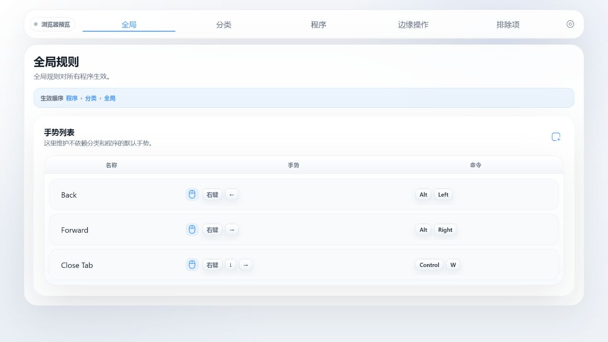

# WuGesture

Windows 鼠标手势应用，基于 C# WinForms、WebView2 和原生全局鼠标钩子。


手势轨迹与命中动作会直接显示在当前桌面上，不打断正在进行的操作。



## 功能

- 右键和中键 8 方向手势，支持全局、分类和程序规则。
- 支持快捷键、窗口控制、音量与亮度调节，以及边缘操作。
- 提供应用排除、托盘驻留和 WebDAV 配置备份。

## 下载与运行

从发行页下载并完整解压 ZIP，运行 `WuGesture.exe`。该轻量包需要 [.NET 10 Desktop Runtime x64](https://dotnet.microsoft.com/download/dotnet/10.0/runtime)；首次启动时若缺少 [WebView2 Runtime](https://developer.microsoft.com/microsoft-edge/webview2/)，应用会提供下载引导。

配置文件位于：`%AppData%\WuGesture\gestures.json`。

## 开发

### 项目环境

- Windows 10/11 x64
- .NET 10 SDK
- Node.js 22 和 pnpm
- C# / WinForms / WebView2，前端使用 Vue 3 + Vite

首次准备前端依赖：

```powershell
cd src\WuGesture.App\Web
pnpm install
```

### 运行

```powershell
dotnet run --project src\WuGesture.App\WuGesture.App.csproj
```

### 构建

```powershell
dotnet build WuGesture.slnx
```
